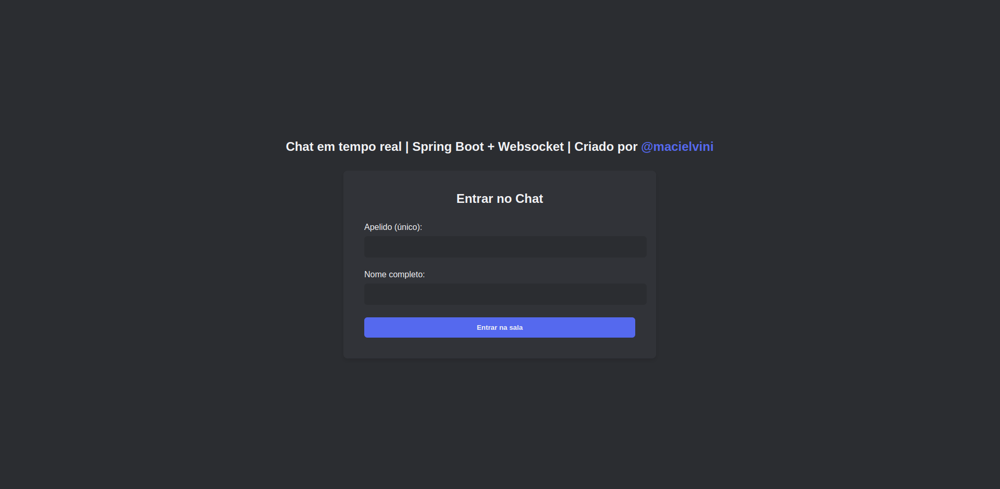
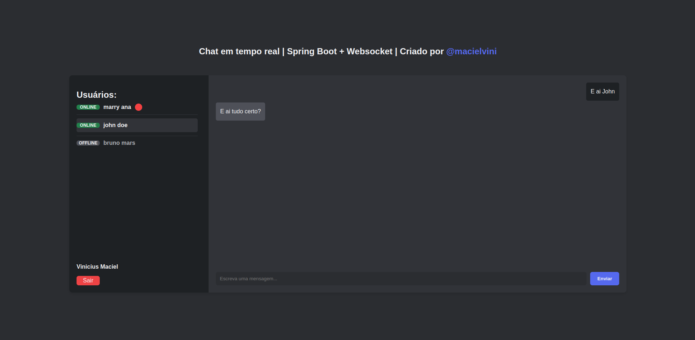

### Objetivos

O objetivo da aplicação é fornecer aos usuários uma maneira rápida e fácil de se comunicar.
> Projeto criado para aprimorar meus conhecimentos em Java, Spring Boot e Websockets.

---

### Tecnologias
- **Backend**
  - Java 17
  - Maven
  - Spring Boot
  - Lombok
  - Websockets
  - Mongo DB
- **Frontend**
  - Javascript
  - HTML
  - CSS

---
 
### Como instalar

1. Abra seu terminal e clone esse repositorio:
```bash
git clone https://github.com/macielvini/spring-chat.git
```   
2. Entre na pasta do projeto
```bash
cd spring-chat
```
3. Renomeie o arquivo `.env.example` para `.env` e preencha todas as variávies

#### 🐋 Rodando com Docker

⚠️ **Atenção**: Você precisa ter o docker e o docker compose instalados em sua máquina para rodar o projeto.
Execute no terminal:
```
docker compose up --build
```

Pronto, seu projeto está no ar! E pode ser acessado na rota http://localhost:8088

#### Rodando sem docker

⚠️ **Atenção**: Recomendo fortemente rodar com Docker, mas se quiser rodar sem você precisará do MongoDB, JDK e JRE instalados em sua máquina.

1. Após acessar a pasta do projeto, execute no terminal:
```bash
./mvnw clean package
``` 
3. Execute no terminal:
```bash
java -jar target/spring-chat-0.0.1-SNAPSHOT.jar
```

Pronto, seu projeto está no ar! E pode ser acessado na rota http://localhost:8088

---
 
### Screenshots





#### [🚨](https://emojiterra.com/pt/luz-giratoria/) Em caso de dúvida, entre em contato.

[Email](vm.viniciusmaciel@gmail.com)

[Linkedin](https://www.linkedin.com/in/macielvinicius/)
